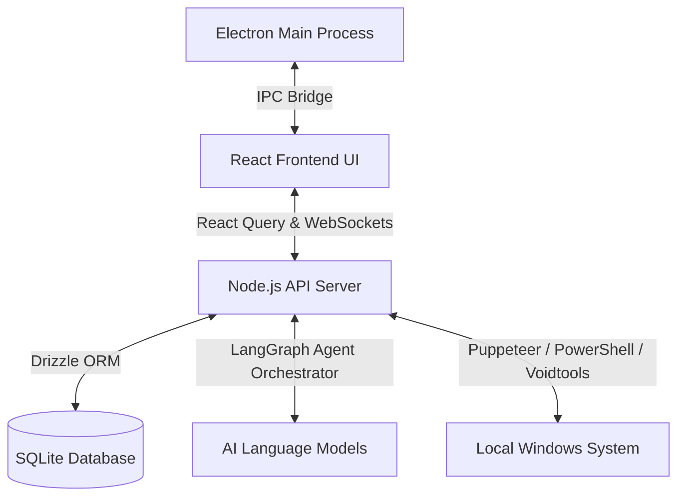

# 🤖 JARVIS Assistant Companion

[](https://opensource.org/licenses/MIT)
[]()
[]()

> A sentient-like, multi-modal desktop assistant that roams your screen, understands your environment, and executes complex system actions on your command.

JARVIS (Just A Rather Very Intelligent System) is a state-of-the-art desktop AI companion built with **Electron**, **React**, **Node.js**, and **LangGraph**. More than just a chatbot, JARVIS lives on your screen as a fully interactive desktop pet with physics, moods, and direct control over your computer's tools.

---

## 🎨 System Architecture



---

## ✨ Features Overview

### 🦊 1. Interactive Desktop Pet & Physics Engine
*   **Mini Mode Overlay:** Toggle a transparent, click-through overlay that houses the interactive agent (e.g. Fox) floating on top of all application windows.
*   **Affection & Mood System:** The relationship engine tracks how you interact with him.
    *   *High Affection (Best Friends):* High energy, snappy physics, frequent cursor tracking, and playful bounce animations.
    *   *Low Affection (Neglected):* Heavy gravity, sluggish physics, and idle sleep cycles.
*   **Diverse Movement Styles:** Roams around your screen with unique motion dynamics (float, dash, jump, teleport, crawl, bounce, cartwheel, zigzag, and pace).

### ⚙️ 2. Advanced Multi-Modal Agent Orchestration (LangGraph)
*   **Autonomous Tool Chaining:** Powered by LangGraph, JARVIS can chain multiple tools in a single flow to answer complex requests.
*   **True Visual Context:** He takes automatic screenshots of your active window to look at code, watch videos, read documents, and comment on your activities in real-time.
*   **Interruptible Stream (Stop Button):** Instantly cancel long-running tool execution chains directly from the UI to prevent loops.

### 🎙️ 3. Hands-Free Voice Control & Advanced TTS
*   **Voice Activity Detection (VAD):** Smart audio input threshold detection lets you speak naturally and stops recording automatically when you pause.
*   **3 Voice Synthesis Engines:**
    *   🌐 *Browser Speech API:* System native speech synthesis (free, offline fallback).
    *   🎙️ *Groq Orpheus TTS (`canopylabs/orpheus-v1-english`):* Expressive English voices supporting natural vocal direction tags (e.g. `[cheerful]`, `[whisper]`) and auto-chunking to handle API limitations.
    *   📂 *Custom WAV File:* Local fallback playback where you can supply a custom audio file (e.g., standard Jarvis chime sound).

### 🛠️ 4. Local OS Tool Integration
*   **Voidtools Everything Search:** Instantaneous local file index searching across your entire machine.
*   **System Automation:** Run PowerShell/CMD commands, perform window tracking, and control local workflows.
*   **Integrations:** Connected directly to your **Spotify**, **Notion**, and **GitHub** APIs to search playlists, query notes, and review repositories.

---

## 📂 Project Structure

```
├── artifacts/
│   ├── jarvis/            # Electron App & Vite React Frontend
│   │   ├── src/           # Component layouts, physics hooks, and overlays
│   │   └── electron/      # Main and Preload IPC controllers
│   └── api-server/        # Node.js API server & LangGraph Tool Integrations
│
├── packages/
│   └── db/                # SQLite connection database schema via Drizzle ORM
│
└── lib/
    ├── api-spec/          # OpenAPI v3 spec configuration (openapi.yaml)
    ├── api-client-react/  # Generated React Query API client
    └── api-zod/           # Generated Zod validation schemas
```

---

## 🚀 Getting Started

### Prerequisites
*   **Node.js:** v20.x or higher
*   **pnpm:** v9.x or higher
*   **OS:** Windows 10/11 is recommended to support native PowerShell automation, screen captures, and Everything search indexing.

### Setup & Run
1.  Clone the repository:
    ```bash
    git clone https://github.com/Abhishekkkk-15/jarvis-assistant.git
    cd jarvis-assistant
    ```
2.  Install dependencies:
    ```bash
    pnpm install
    ```
3.  Start the Development Environment (starts API Server + Electron app):
    ```bash
    pnpm run dev:desktop
    ```

### Keyboard Shortcuts
*   `F11`: Toggle application fullscreen mode.
*   `Ctrl + Shift + Space`: Toggle JARVIS Main Window visibility.
*   `Ctrl + Shift + K`: Toggle Quick Command Input panel.
*   `Ctrl + Shift + I`: Open Chromium Developer Tools.